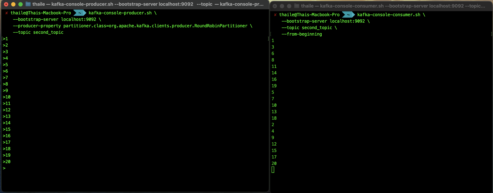
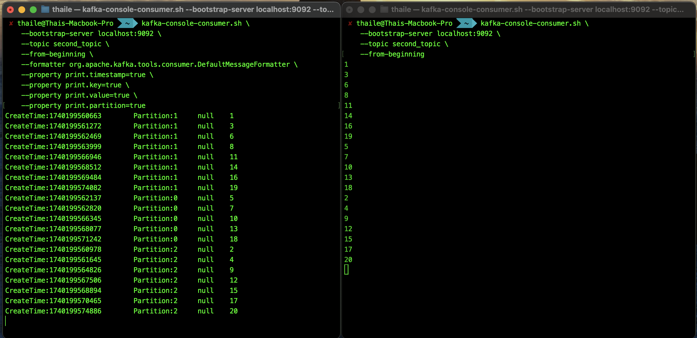

# Kafka Consumers CLI

Kafka consumers are applications responsible for reading data from Kafka topics. They read messages from Kafka brokers and process them according to the application's requirements. Consumers can read messages from the beginning or end of a topic, and they can be configured to read messages in a specific order or with specific properties.

## 1️. Create a Topic with 3 Partitions

A Kafka topic is where messages are stored. Partitions allow messages to be parallelized across brokers. 
Create a topic with 3 partitions using the `kafka-topics.sh` script. Partitions are used to distribute messages across multiple brokers and improve performance and scalability.

```sh
# Terminal 1 (Topic) - Create a topic named 'second_topic' with 3 partitions
kafka-topics.sh \
    --bootstrap-server localhost:9092 \
    --topic second_topic \
    --create \
    --partitions 3
```

## 2️. Start a Consumer

A Kafka consumer subscribes to a topic and reads messages. The consumer reads messages from a topic. Start a consumer to read messages from the `second_topic` topic.

```sh
# Terminal 2 (Consumer) - Consuming from the topic
kafka-console-consumer.sh \
    --bootstrap-server localhost:9092 \
    --topic second_topic \
```

## 3️. Produce Messages to the Topic

Kafka producers send messages to topics. By default, messages are sent to partitions based on a key or in a round-robin fashion.

The `RoundRobinPartitioner` distributes messages evenly across partitions to balance the load. However, it should not be used for applications that require message order. As each message is produced, it will be sent to the next consumer (seen in the consumer terminal). This should be avoided in production environments.

```sh
# Terminal 3 (Producer) - Producing messages to the topic
kafka-console-producer.sh \
    --bootstrap-server localhost:9092 \
    --producer-property partitioner.class=org.apache.kafka.clients.producer.RoundRobinPartitioner \
    --topic second_topic
> 1
> 2
> 3
> 4
> 5
> 6
> 7
> 8
> 9
> 10
> 11
> 12
> 13
> 14
> 15
> 16
> 17
> 18
> 19
> 20
>^C # to exit
```

## 4️. Consume Messages from the Beginning

Use the `--from-beginning` flag to consume messages from the beginning of the topic. This will display all messages from the beginning of the topic, including messages produced before the consumer started. It will still display new messages as they are produced.

Note that messages may appear out of order because the `RoundRobinPartitioner` distributes messages to partitions in a round-robin manner. Consequently, data is read in order by partition, not by message.

```sh
# Terminal 2 (Consumer) - Consuming from the beginning of the topic
kafka-console-consumer.sh \
    --bootstrap-server localhost:9092 \
    --topic second_topic \
    --from-beginning
```



## 5️. Display Message Metadata (Key, Value, Partition, Timestamp)

Use the `--formatter` flag to display message metadata, such as the key, value, partition, and timestamp. This will show the key, value, partition, and timestamp of each message consumed by the consumer.

With this it can be seen that the messages are distributed to the partitions and thus the order is per partition, not per message

```sh
# Terminal 2 (Consumer) - Consuming from the beginning of the topic with message metadata
kafka-console-consumer.sh \
    --bootstrap-server localhost:9092 \
    --topic second_topic \
    --from-beginning \
    --formatter org.apache.kafka.tools.consumer.DefaultMessageFormatter \
    --property print.timestamp=true \
    --property print.key=true \
    --property print.value=true \
    --property print.partition=true
```



## 6️. Delete the Topic

Delete the topic using the `kafka-topics.sh` script. Deleting a topic removes all messages and metadata associated with the topic. Be cautious when deleting topics, as this action is irreversible.

```sh
# Terminal 1 (Topic) - Delete the topic
kafka-topics.sh \
    --bootstrap-server localhost:9092 \
    --topic second_topic \
    --delete
```
