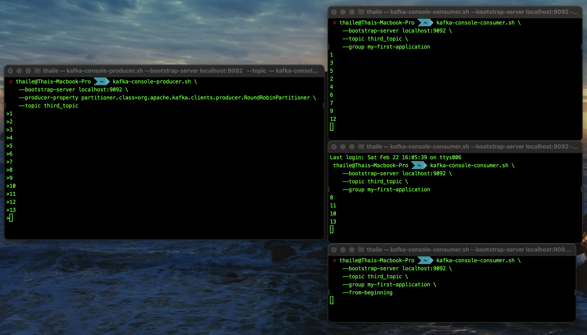
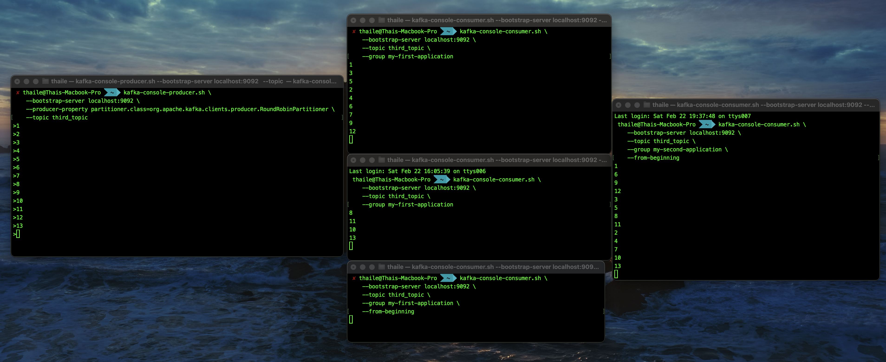

# Kafka Consumer Groups

Kafka consumer groups are used to balance the load of consuming messages from topics by distributing them among multiple consumers. Each consumer group consists of one or more consumers that collaboratively consume messages from assigned topics. This setup enables parallel processing, improves scalability, and ensures fault tolerance within the group.

## 1️. Create a Topic with 3 Partitions

Kafka topics store messages, and partitions allow messages to be parallelized across brokers. Creating multiple partitions enables scalability and load balancing.

```sh
# Terminal 1 (Topic) - Create a topic named 'third_topic' with 3 partitions
kafka-topics.sh \
    --bootstrap-server localhost:9092 \
    --topic third_topic \
    --create \
    --partitions 3
```

## 2️. Start a Consumer in a Consumer Group

Kafka consumers subscribe to a topic and read messages. When a consumer joins a group, Kafka automatically distributes partitions among available consumers.

```sh
# Terminal 2 (Consumer #1) - Start a consumer in 'my-first-application' group
kafka-console-consumer.sh \
    --bootstrap-server localhost:9092 \
    --topic third_topic \
    --group my-first-application
```

## 3️. Start a Producer and Send Messages

Kafka producers send messages to topics. The `RoundRobinPartitioner` distributes messages evenly across partitions.

```sh
# Terminal 3 (Producer) - Producing messages to the topic
kafka-console-producer.sh \
    --bootstrap-server localhost:9092 \
    --producer-property partitioner.class=org.apache.kafka.clients.producer.RoundRobinPartitioner \
    --topic third_topic
> Message 1
> Message 2
> Message 3
> Message 4
> Message 5
>^C # to exit
```

## 4️. Add Another Consumer to the Same Group

Adding another consumer to the same consumer group allows Kafka to distribute partitions among them. Messages are balanced between the two consumers.

```sh
# Terminal 4 (Consumer #2) - Start another consumer in 'my-first-application' group
kafka-console-consumer.sh \
    --bootstrap-server localhost:9092 \
    --topic third_topic \
    --group my-first-application
```

## 5. Add Another Consumer to the Same Group with --from-beginning

```sh
# Terminal 5 (Consumer #3) - Start another consumer in 'my-first-application' group
kafka-console-consumer.sh \
    --bootstrap-server localhost:9092 \
    --topic third_topic \
    --group my-first-application \
    --from-beginning
```



The `--from-beginning` flag only applies if the consumer group has no previously **committed offsets**.

- If a **new consumer group** starts with `--from-beginning`, it will read all messages from the topic's earliest available offset.
- If a consumer joins an existing group, Kafka ignores --from-beginning and resumes from the last committed offset.

This means that when a new consumer joins **an already existing group** (e.g., my-first-application), it will **not** read old messages from the topic—even if `--from-beginning` is specified—because Kafka resumes consumption from the last committed offset for that group.

A **committed offset** in Kafka represents the last successfully processed message by a consumer group for a given topic partition. Kafka uses offsets to track which messages have been read, ensuring that consumers resume from where they left off in case of failure or restart.

**Types of Offsets:**

- **Current Offset:** The offset of the next message the consumer will read.
- **Committed Offset:** The last offset that has been acknowledged (or "saved") by a consumer group.
- **Uncommitted Offset:** Messages that have been read but not committed, meaning they could be reprocessed in case of failure.

**Understanding Consumer Group Offsets:**

- Kafka keeps track of what each consumer group has read using committed offsets.
- When a consumer joins an existing group, it starts consuming from the last committed offset unless told otherwise.
- The `--from-beginning` flag only applies if the consumer group has no previous offsets recorded.

**How Kafka Consumers Use Committed Offsets:**
When a consumer restarts, Kafka looks at the committed offset and starts consuming from there.

**Example:**

1. A consumer reads messages up to offset 50 but only commits up to offset 45.
2. The consumer crashes and restarts.
3. Kafka will resume reading from offset 45 (the last committed one), not 50.

**Why Committed Offsets Matter:**

- Prevents duplicate processing: Ensures messages aren’t re-read if a consumer crashes.
- Allows consumer groups to scale: New consumers can join and start from the right place.
- Enables replaying messages: If offsets are reset, a consumer can reprocess messages.

## 6. Start a Consumer in a Different Group from the Beginning with --from-beginning

```sh
# Terminal 6 (Consumer #4) - Start a consumer in 'my-second-application' group from the beginning
kafka-console-consumer.sh \
    --bootstrap-server localhost:9092 \
    --topic third_topic \
    --group my-second-application \
    --from-beginning
```



A new consumer group can read all messages from the beginning using the `--from-beginning` flag. Since consumer groups track offsets independently, a new group will consume all past messages.

In this example, a completely new consumer group (my-second-application) that has never been seen by Kafka before. Since Kafka doesn’t have any committed offsets for this group, it will start consuming from the beginning of the topic.
