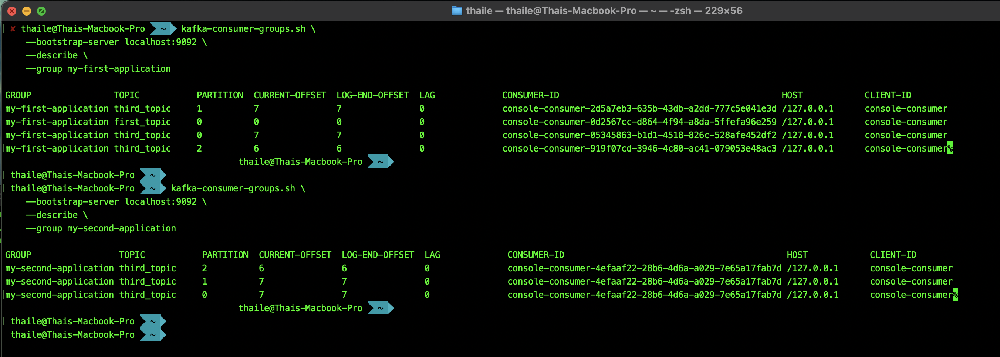

# Kafka Consumer Groups Management

Kafka provides tools to manage consumer groups, allowing users to track offsets and monitor consumption behavior. The `kafka-consumer-groups.sh` command enables listing, describing, and managing consumer groups.

## 1️. List Consumer Groups

Retrieve a list of all existing consumer groups in the Kafka cluster.

```sh
# List all consumer groups
kafka-consumer-groups.sh \
    --bootstrap-server localhost:9092 \
    --list
```

## 2️. Describe a Specific Consumer Group

View detailed information about a consumer group, including assigned partitions and offsets.

```sh
# Describe the 'my-first-application' group
kafka-consumer-groups.sh \
    --bootstrap-server localhost:9092 \
    --describe \
    --group my-first-application
```

```sh
# Describe the 'my-second-application' group
kafka-consumer-groups.sh \
    --bootstrap-server localhost:9092 \
    --describe \
    --group my-second-application
```



- **Current Offset:** The offset of the next message the consumer will read.
- **Log End Offset:** The offset of the last message in the partition.
- **Lag:** The difference between the log end offset and the current offset. It represents the number of messages yet to be processed by the consumer group.

If there's a lag, it indicates that the consumer group is behind in processing messages. This could be due to slow consumers, network issues, or other factors.

## 3️. Start a Consumer in a Group

Consumers read messages from a topic as part of a group. This command starts a consumer in `my-first-application` group.

```sh
# Start a consumer in 'my-first-application' group
kafka-console-consumer.sh \
    --bootstrap-server localhost:9092 \
    --topic first_topic \
    --group my-first-application
```

## 4️. Describe a Consumer Group After Starting a Consumer

Once a consumer starts, check how the group's partitions are assigned and offset progress.

```sh
# Describe the 'my-first-application' group after starting a consumer
kafka-consumer-groups.sh \
    --bootstrap-server localhost:9092 \
    --describe \
    --group my-first-application
```

### 5. Console Consumer without Group

If a consumer is created with a group ID, it will become be assigned a unique temporary group ID. This group is not persisted and will be removed after the consumer disconnects.

```sh
# Start a console consumer without a group
kafka-console-consumer.sh \
    --bootstrap-server localhost:9092 \
    --topic first_topic
```

```sh
# List all consumer groups
# The temporary group ID will be displayed here, which is typically in the format 'console-consumer-<random_number>'
kafka-consumer-groups.sh \
    --bootstrap-server localhost:9092 \
    --list    
```

## 6. Describe a Console Consumer Group

Kafka assigns console consumer groups dynamically. To inspect one, modify the group ID accordingly.

```sh
# Describe a dynamically assigned console consumer group
kafka-consumer-groups.sh \
    --bootstrap-server localhost:9092 \
    --describe \
    --group console-consumer-10592
```

## 7. Start Another Console Consumer

Start another consumer under `my-first-application` to see partition rebalancing in action.

```sh
# Start another console consumer in 'my-first-application' group
kafka-console-consumer.sh \
    --bootstrap-server localhost:9092 \
    --topic first_topic \
    --group my-first-application
```

## 8. Describe the Group Again

After adding another consumer, recheck the consumer group to see the updated assignments.

```sh
# Describe the 'my-first-application' group after adding another consumer
kafka-consumer-groups.sh \
    --bootstrap-server localhost:9092 \
    --describe \
    --group my-first-application
```
