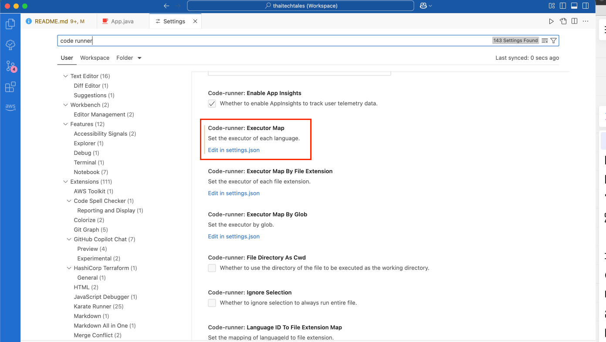

# 📂 `projects/` - End-to-End Kafka Projects

## 📌 Overview

The `projects/` directory contains **full real-world Kafka projects**, including event-driven architectures, data pipelines, and analytics solutions. It includes complete, real-world Kafka projects that involve multiple components. Each project is standalone and implements a specific business use case.

## Setting up Gradle Project for Kafka in Java

When starting a new Kafka project in Java, setting up the Gradle project correctly is essential. The following steps provide a recommended approach for initialising a new Gradle project for Kafka:

### Example of Recommended Gradle Initialisation

| Step                        | Recommended Option                                      | Reason |
|-----------------------------|--------------------------------------------------------|---------------------------------------------------------------|
| **Gradle Init Step**        | `gradle init`                                         | Initialises a new Gradle project with interactive setup. |
| **Build Type**              | 1: Application                                         | Provides an entry point, making it suitable for Java apps. |
| **Implementation Language** | 1: Java                                               | Commonly used for backend applications and Kafka projects. |
| **Target Java Version**     | 17 (LTS version, stable for Kafka)                    | Ensures long-term support, stability, and compatibility. |
| **Project Name**            | *(Choose a descriptive name, e.g., `test-kafka-project`)* | Helps with project identification and organisation. |
| **Application Structure**   | 1: Single application project                         | Ideal for standalone apps; multi-module setups can be added later. |
| **Build Script DSL**        | 1: Kotlin (modern & type-safe)                        | Provides type safety, modern syntax, and better tooling support. |
| **Test Framework**          | 4: JUnit Jupiter (latest version)                     | JUnit 5 is the latest, flexible, and widely used testing framework. |
| **Enable New APIs & Behavior?** | No (to keep stability)                      | Avoids experimental features that might change in minor releases. |

### Additional Notes

- Ensure that the Java 17 SDK is installed and set up correctly.
- Use Kotlin DSL for Gradle build scripts to take advantage of type safety and modern syntax.
- JUnit Jupiter is recommended for testing as it is the latest version of JUnit.
- Keeping new APIs and behavior disabled ensures compatibility and stability.

## Update `build.gradle.kts` to Use Kafka

After setting up the Gradle project, the next step is to add the Kafka dependencies to the `build.gradle.kts` file. Before proceeding, check the installed Kafka version and update the dependencies accordingly. As of this writing, the latest stable version is `3.9.0`.

### 1. Check the installed Kafka version

```bash
kafka-topics.sh --version
```

### 2. Update the Kafka dependencies in `build.gradle.kts`

`build.gradle.kts` can be located in `app/`. 

In order to find the correct version of Kafka, check the [Maven Repository](https://mvnrepository.com/artifact/org.apache.kafka/kafka-clients) for the latest version.

#### Steps to Add Kafka-Clients Dependency:

Kafka-clients is the main dependency for Kafka producers and consumers.

1. https://mvnrepository.com/artifact/org.apache.kafka
2. Select kafka-clients
3. Select the latest version, which is 3.9.0 as of this writing.
4. Because the build script is in Kotlin, select the `Gradle (Kotlin)` tab to retrieve the correct syntax.
5. Copy the dependency and paste it into the `build.gradle.kts` file within the `dependencies` block.
6. Final link: https://mvnrepository.com/artifact/org.apache.kafka/kafka-clients/3.9.0

#### Steps to Add `slf4j`

slf4j is a logging facade that is commonly used with Kafka. It is optional but recommended to include logging in Kafka projects.

1. https://mvnrepository.com/artifact/org.slf4j/slf4j-api
2. Select slf4j-api
3. Select the latest version, which is 2.0.16 as of this writing.
4. Because the build script is in Kotlin, select the `Gradle (Kotlin)` tab to retrieve the correct syntax.
5. Copy the dependency and paste it into the `build.gradle.kts` file within the `dependencies` block.
6. Final link: https://mvnrepository.com/artifact/org.slf4j/slf4j-api/2.0.16

#### Steps to Add `slf4j-simple`

slf4j-simple is a simple logging implementation that can be used with slf4j.

1. https://mvnrepository.com/search?q=slf4j+simple
2. Select slf4j-simple
3. Select the latest version, which is 2.0.16 as of this writing.
4. Because the build script is in Kotlin, select the `Gradle (Kotlin)` tab to retrieve the correct syntax.
5. Copy the dependency and paste it into the `build.gradle.kts` file within the `dependencies` block.
6. Final link: https://mvnrepository.com/artifact/org.slf4j/slf4j-simple/2.0.16

Add the following dependencies to the `build.gradle.kts` file to include Kafka and Kafka Streams in the project:

```kotlin
dependencies {

    // https://mvnrepository.com/artifact/org.apache.kafka/kafka-clients
    implementation("org.apache.kafka:kafka-clients:3.9.0")

    // Logging (optional but recommended)
    // https://mvnrepository.com/artifact/org.slf4j/slf4j-api
    implementation("org.slf4j:slf4j-api:2.0.16")

    // https://mvnrepository.com/artifact/org.slf4j/slf4j-simple
    testImplementation("org.slf4j:slf4j-simple:2.0.16")

    // JUnit for testing
    testImplementation(libs.junit.jupiter)
    testRuntimeOnly("org.junit.platform:junit-platform-launcher")

    // Other dependencies
    implementation(libs.guava)
}
```

### 3. Apply the changes by running:

Ensure the directory is set to the project root before running the following command:

```bash
gradle build
```

### 4. Verify the dependencies

Check the dependencies are correctly added by running:

```bash
# gradle dependencies --configuration runtimeClasspath
gradle :app:dependencies --configuration runtimeClasspath
```

### Summary

- Kafka broker is 3.9.0, so use Kafka clients 3.9.0
- Add dependencies either directly in `build.gradle.kts`
- Run gradle build to ensure everything is correctly set up.

## Run in VS Code

To run a Java project, while in the root of the project run the following command in the terminal:

```bash
gradle :app:run
```

Alternatively, download the Code Runner extension in VS Code and run the and configure the `settings.json` by:

1. Open VS Code and go to Settings `(Cmd + ,)`.
2. Search for Code Runner: Executor Map.
3. Click Edit in settings.json.
4. Modify the Java command inside the "code-runner.executorMap" section


```json
{
    "code-runner.executorMap": {
        "java": "cd $dir && javac -d . $fileName && java org.example.$fileNameWithoutExt",
    }
}
```

5. (Optional) Automatically clear output before running code
to clear the output window:
    1. Open VS Code Settings (Cmd + , on Mac).
    2. Search for `code-runner.clearPreviousOutput`.
    3. Enable the option: `Clear previous output before running`.
6. Save the settings.json file.
